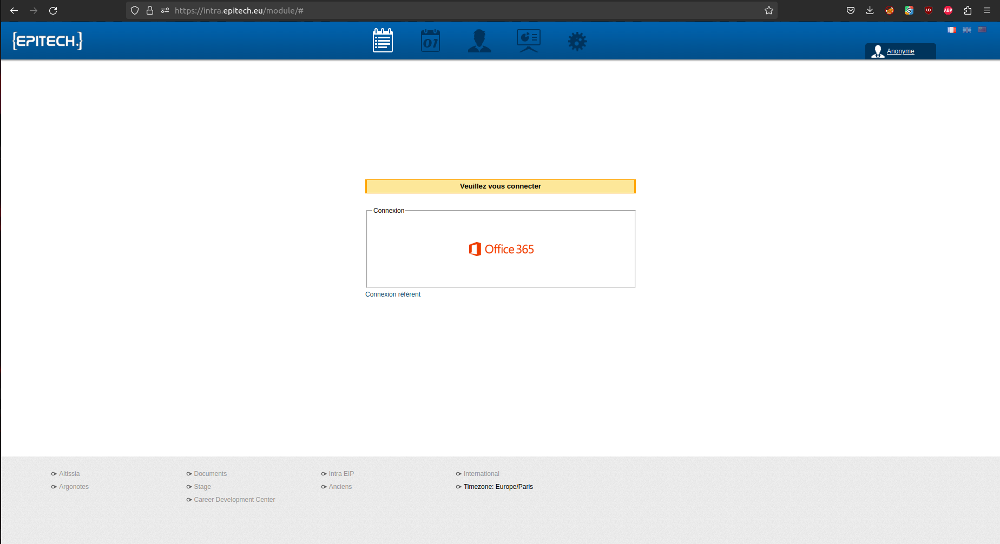
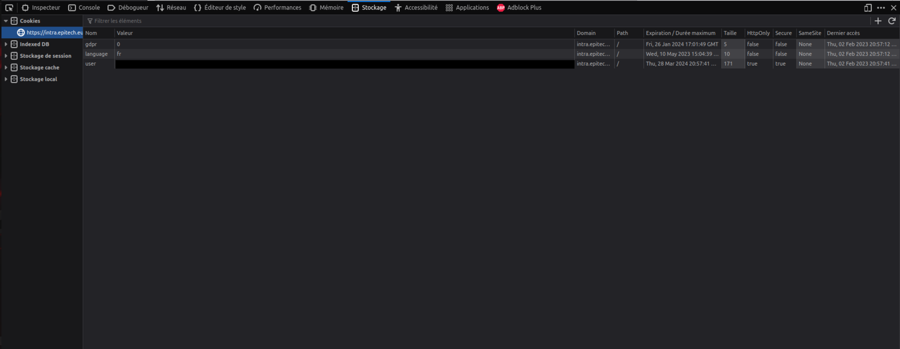

# Intranet Reminder

---

Intranet Reminder (intra-reminder) is a small python script that use the (ugly) EPITECH intranet API to remind you on arriving events.

It can send you messages on discord using Webhooks, send you notifications on your desktop, and set itself as autostart, so that it never goes off.

---

## <u>Instalation</u>

Instalation is made using the [install.sh](null) file.

Install `python3` and `python3-pip` using your package manager (apt-get, dnf...)

Clone this repo, update the `config` file and run `./install.sh`.

Please note some of the configs you can / need to change on the `config` file :

- **Webhook URL** : This specify the URL of the webhook used to send daily reports, reminders...

- **Notify command** : This command is used to show you a notification on your desktop. Please note that, depending on your system, the default one might not work.

- **Reminder timer** : This list define the reminders you might want to set to ping you : for example, the default one will ping you 1 hour, 30 minutes, and 10 minutes before the event.

- **\*\*\*\*\* message** : These define the messages you will receive for those events.

- **Unsub distance** : This define the nb of days to check for unsub : if you set 3 (by default), monday it will check for all events on wednesday.

- **API-key** : This is the API key that you can find on the intranet. If you don't have it, it will not work. The following pictures will help you finding it :

Get your API key

Go to the [EPITECH intranet](https://intra.epitech.eu/)

Login, and open up the dev section (f12 for Firefox, for chrome IDK, because Firefox > chrome).

Go get your token on the cookies section (Storage>Cookies on Firefox)

Get the value of that cookie. It is your API token.

---

Enjoy !

_Sorry for my english <3_