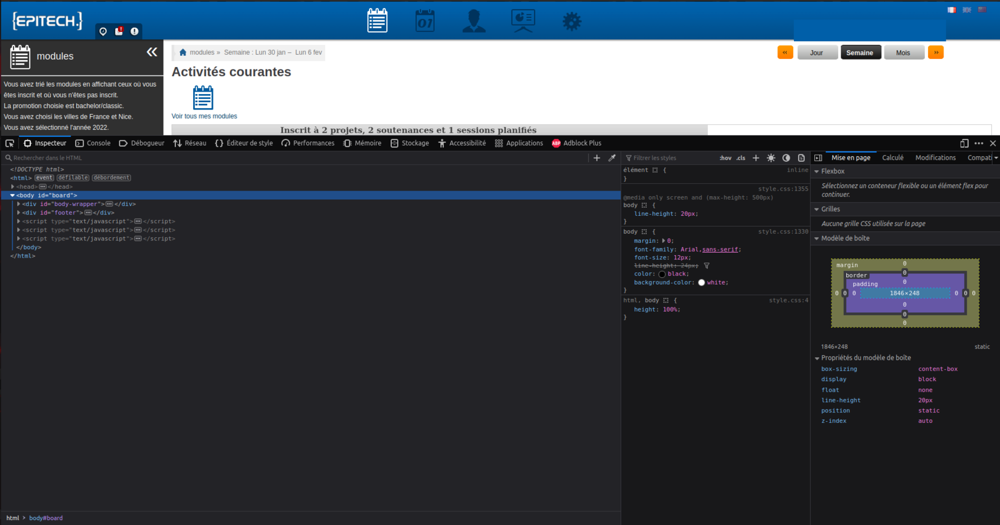

# Intranet Reminder

---

Intranet Reminder (intra-reminder) is a small python script that use the (ugly) EPITECH intranet API to remind you on arriving events.

It can send you messages on discord using Webhooks, send you notifications on your desktop, and set itself as autostart, so that it never goes off.

---

## <u>Instalation</u>

Instalation is made using the [install.sh](null) file.

Simply clone this repo, update the `config` file and run `./install.sh`.

Please note some of the configs you can / need to change on the `config` file :

- **API-key** : This is the API key that you can find on the intranet. If you don't have it, it will not work. The following pictures will help you finding it :

Get your API key

Go to the [EPITECH intranet](https://intra.epitech.eu/)

Login, and open up the dev section (f12 for Firefox, for chrome IDK, because Firefox > chrome).

Go get your token on the cookies section (Storage>Cookies on Firefox)

Get the value of that cookie. It is your API token.

